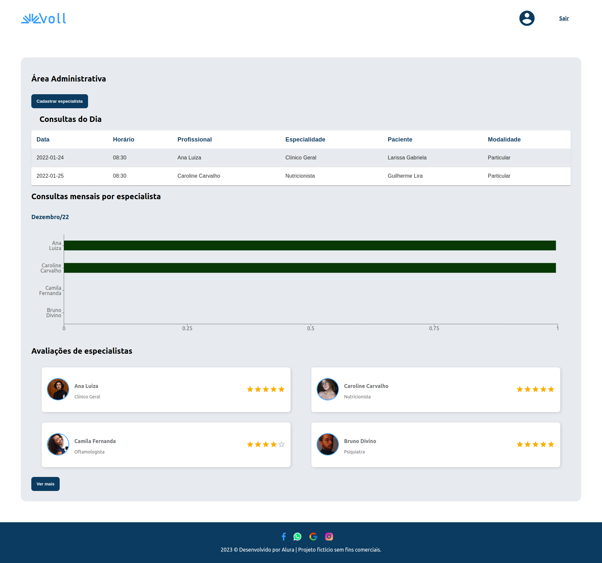

# Voll Dashboard App



Guia de instalação e utilização do projeto.

## Tecnologias utilizadas

- ReactJS com Vite
- Typescript
- Material UI
- ReCharts
## Instalação

- Clonar esse repositório
- Instalar as dependências

```bash
$ npm i
```

- Para rodar a aplicação basta rodar com o comando abaixo:

```bash
$ npm run dev
```
- Rode o server

```bash
$ npm run server
```
